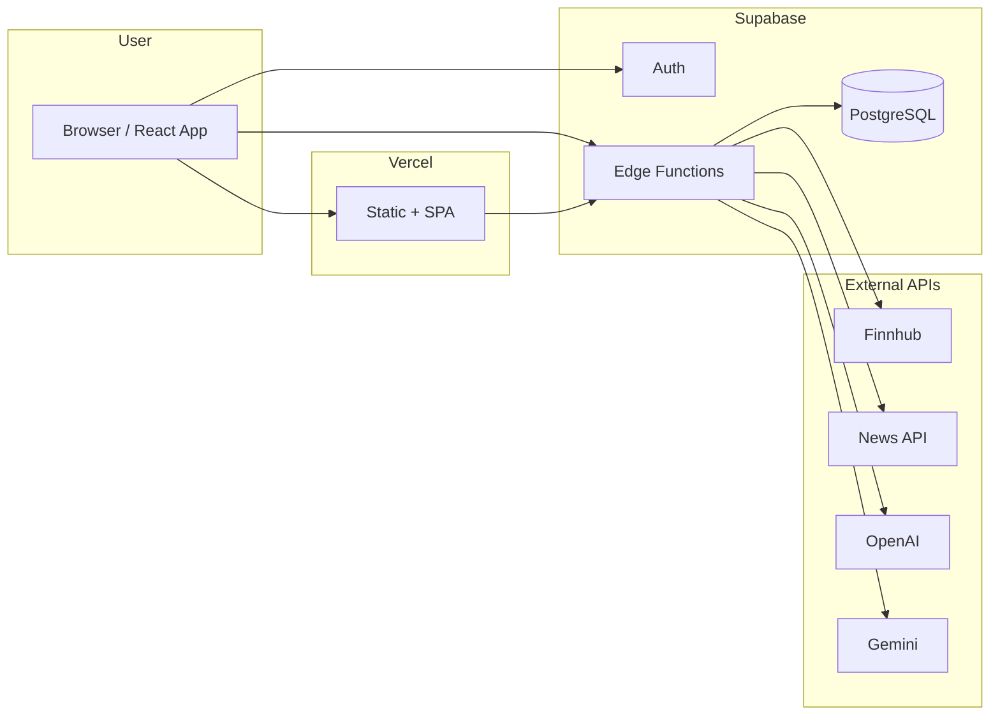
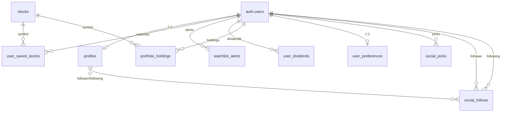
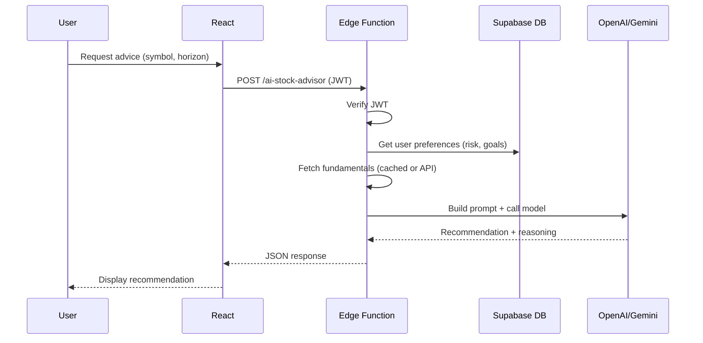
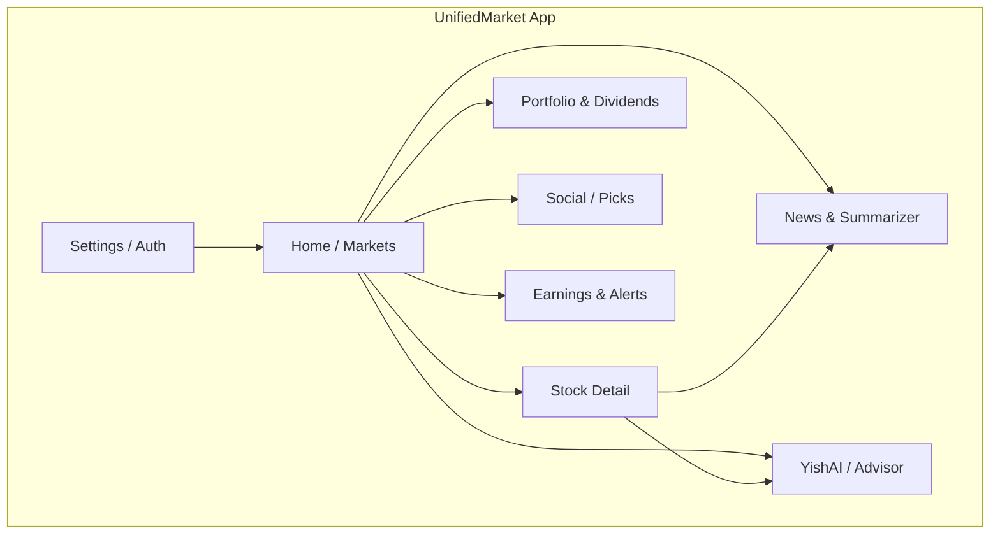

<!-- _class: lead -->
# UnifiedMarket
## Design Document — Technical Sketches & Project Plan

**Fill in before submission:**
- **Team members:** [Names, emails]
- **Supervisor:** [Name, email]
- **Course / Semester:** [e.g. Spring 2026]

---

# Slide 2 — Abstract (Elevator Pitch)

**UnifiedMarket** is a full-stack financial market platform that gives users real-time stock data, AI-powered insights, and social investing in one place.

**Motivation:** Retail investors often juggle multiple tools for prices, news, portfolios, and ideas. We aim to unify market data, AI analysis, and community signals in a single, responsive web app.

**Aims:** Deliver live prices and charts (via Finnhub), AI stock advice and news summarization (OpenAI/Gemini), portfolio and dividend tracking, earnings calendars and alerts, and a social layer where users share picks and follow others.

**Scope:** Frontend (React + TypeScript on Vite), backend (Supabase: PostgreSQL, Auth, Edge Functions), and integrations with Finnhub, News API, and AI APIs. Security via Row-Level Security and JWT; deployment on Vercel (frontend) and Supabase (backend).

---

# Slide 3 — Tools (Software, Hardware, Versions)

| Category | Tool | Version / Note |
|----------|------|----------------|
| **Frontend** | React | 18.3.x |
| | TypeScript | 5.8.x |
| | Vite | 5.4.x |
| | Tailwind CSS | 3.4.x |
| | React Router | 6.30.x |
| | TanStack Query | 5.83.x |
| | Recharts | 2.15.x |
| **Backend** | Supabase (PostgreSQL, Auth) | — |
| | Supabase Edge Functions (Deno) | — |
| **APIs / Data** | Finnhub API | Market data |
| | News API | Financial news |
| | OpenAI API | AI features |
| | Google Gemini API | AI features |
| **Dev** | Node.js | 18+ |
| | ESLint | 9.x |
| **Deploy** | Vercel | Frontend hosting |
| | Supabase Cloud | DB + functions |
| **Hardware** | Standard dev machine; no special hardware |

---

# Slide 4 — Diagram 1: High-Level Data Flow

**Flow:** User hits Vercel-hosted React app → auth and data go through Supabase (Auth + Edge Functions) → Edge Functions call DB and external APIs (Finnhub, News, AI) → responses return to the client.

---

# Slide 5 — Diagram 2: Database Schema (Core Tables)

**Tables:** `profiles`, `user_saved_stocks`, `watchlist_alerts`, `user_dividends`, `portfolio_holdings`, `user_preferences`, `social_picks`, `social_follows`, `stocks` (+ discussions, news_sentiment, morning_briefs, ai_usage). All user tables use Row-Level Security (RLS).

---

# Slide 6 — Diagram 3: Programming Logic Flow (Example: AI Stock Advisor)

**Logic:** Frontend sends authenticated request → Edge Function validates user, loads preferences and data, calls AI API, returns structured recommendation to the UI.

---

# Slide 7 — Diagram 4: User Interface / App Structure

**UI organization:** Main entry (Home/Markets), detail and analysis (Stock Detail, AI), user data (Portfolio, Dividends, Alerts), content (News, Summarizer), community (Social, Picks), and Settings/Auth.

---

# Slide 8 — Tentative Schedule (Remainder of Semester)

| Phase | Task goals | Est. duration |
|-------|------------|----------------|
| **Stabilization** | Fix bugs from testing; harden auth and RLS | 1–2 weeks |
| **Performance** | Caching, rate limits, lazy load heavy components | 1 week |
| **Features** | Finish alert delivery (email/push); polish AI prompts | 2 weeks |
| **Social** | Polish leaderboard, follow feed, pick accuracy | 1–2 weeks |
| **Testing & docs** | E2E tests; update README and API docs | 1 week |
| **Deployment** | CI/CD (already in place); production checks | 3–5 days |
| **Report & slides** | Final report, demo prep, design doc updates | 1 week |

**Total (rough):** ~7–9 weeks. Break any phase into smaller tasks (e.g. “Alert delivery” → “Email template” 2d, “Push payload” 2d, “Testing” 1d) for finer time tracking.

---

# Slide 9 — Data Sources & Nature of Datasets

| Source | Nature / Use | Notes |
|--------|----------------|------|
| **Finnhub** | Real-time and historical prices, quotes, fundamentals, symbols | REST API; rate limits apply; used by Edge Functions |
| **News API** | Financial news articles (headlines, summaries, URLs) | Used by `get-news`, smart-news-summarizer |
| **Supabase DB** | User-generated: profiles, watchlists, holdings, alerts, picks, follows | PostgreSQL; RLS; no external “dataset” |
| **OpenAI / Gemini** | No stored dataset; prompts built from user input + DB/API context | Used for advisor, summarizer, risk/daily brief |
| **Twelve Data / Alpha Vantage** | Optional; additional market or fundamental data if integrated | Referenced in CSP; add if scope allows |

Data is a mix of **live APIs** (prices, news), **derived AI outputs** (recommendations, summaries), and **user data** (portfolios, preferences, social).

---

# Slide 10 — Use Case 1: Get AI Stock Recommendation

**Actor:** Logged-in user.  
**Goal:** Receive a concise buy/sell/hold recommendation for a symbol.

**Precondition:** User is authenticated; symbol exists in our universe.

**Flow:**
1. User opens Stock Detail or AI page, selects symbol and time horizon (e.g. 6 months).
2. Frontend sends `POST` to `ai-stock-advisor` with JWT and body `{ symbol, horizon }`.
3. Edge Function loads user preferences (risk, goals), fetches fundamentals, builds prompt, calls OpenAI/Gemini.
4. Edge returns `{ recommendation, reasoning, confidence }`.
5. UI shows recommendation and reasoning.

**Example input:** `{ "symbol": "AAPL", "horizon": "6m" }`  
**Example output:** `{ "recommendation": "hold", "reasoning": "Valuation fair; growth priced in...", "confidence": 3 }`

---

# Slide 11 — Use Case 2: Price Alert Triggered

**Actor:** User who set an alert.  
**Goal:** Be notified when a condition is met (e.g. price above $150).

**Precondition:** User has created a `watchlist_alert` (e.g. price_above, 150, AAPL).

**Flow:**
1. Scheduled Edge Function (e.g. `check-alerts`) runs periodically.
2. It reads active alerts, fetches current prices (e.g. via `get-stock-prices`), compares to targets.
3. When condition is met, it marks alert as triggered and sends notification (email/push as implemented).
4. User sees notification and can open the app to the stock or alerts page.

**Example input:** Alert `{ symbol: "AAPL", alert_type: "price_above", target_price: 150 }`; current price 152.  
**Example output:** Alert updated `triggered_at = now()`; user receives “AAPL is now above $150”.

---

# Slide 12 — Use Case 3: Share a Pick & View Social Feed

**Actor:** Logged-in user (publisher and follower).  
**Goal:** Publish a buy/sell/hold pick and see others’ picks in a feed.

**Flow:**
1. User chooses symbol, pick type (buy/sell/hold/watch), optional reasoning and target price.
2. Frontend sends insert to `social_picks` (via Supabase client or Edge Function); RLS ensures `user_id = auth.uid()`.
3. Other users open Social page; app loads picks from followed users (and optionally public picks).
4. Feed shows symbol, pick type, reasoning, confidence; user can like or follow.

**Example input:** `{ symbol: "MSFT", pick_type: "buy", reasoning: "Cloud growth", confidence_level: 4 }`  
**Example output:** New row in `social_picks`; pick appears in author’s profile and in followers’ feeds.

---

# Slide 13 — Use Case 4: View News & AI Summary (Optional 4th)

**Actor:** Any user (authenticated for summarizer if gated).  
**Goal:** See financial news and an AI-generated summary for a symbol or topic.

**Flow:**
1. User opens News or Stock Detail → News section; optionally selects symbol.
2. Frontend calls `get-news` (and optionally `smart-news-summarizer`) Edge Function.
3. Edge Function fetches from News API, optionally calls OpenAI/Gemini for summary.
4. UI displays headlines, links, and summary text.

**Example input:** `{ symbol: "AAPL" }` or `{ q: "Federal Reserve" }`  
**Example output:** List of articles + “Summary: …” paragraph.

---

# Slide 14 — Individual Time Log (Requirement)

**Requirement:** Each team member keeps an **individual time log** (from start of semester to submission) of all time spent on the project.

**Include:** Data preparation, learning (languages/tools new to you), design, programming, debugging, documentation, reports, meetings.

**Format:** PDF, readable, with **task description** and **hours** (e.g. table: Date | Task | Hours).

**Suggested tools:** Spreadsheet (Excel/Sheets), Notion, Toggl, or a simple table in a doc — export or print to PDF for submission.

**Example rows:**

| Date       | Task                          | Hours |
|-----------|--------------------------------|-------|
| 2026-01-15| Setup Supabase, auth flow     | 3     |
| 2026-01-16| Finnhub Edge Function + RLS   | 4     |
| …         | …                              | …     |

Submit this **together with** the design document in your group’s **latest submission attempt** (all files in one attempt; max 3 attempts).

---

# Slide 15 — Summary & Next Steps

- **UnifiedMarket** unifies market data, AI insights, and social features in one web app (React + Supabase).
- **Diagrams** in this deck: data flow, DB schema, AI advisor flow, UI structure.
- **Schedule** and data sources are tentative; adjust to your semester dates and scope.
- **Use cases** define how the system is used (AI recommendation, alerts, social picks, news/summary).
- **Before submission:** Fill in title slide (team, supervisor), export to **PDF** as `Design_Documents_UnifiedMarket.pdf`, and include your **individual time log PDF** in the same submission.

**Suggested reading (from assignment):**  
freecodecamp.org (software design doc), ClickUp (design doc), GeeksforGeeks (design documentation), Archbee (diagrams), ByteByteGo/system-design-101, donnemartin/system-design-primer.
